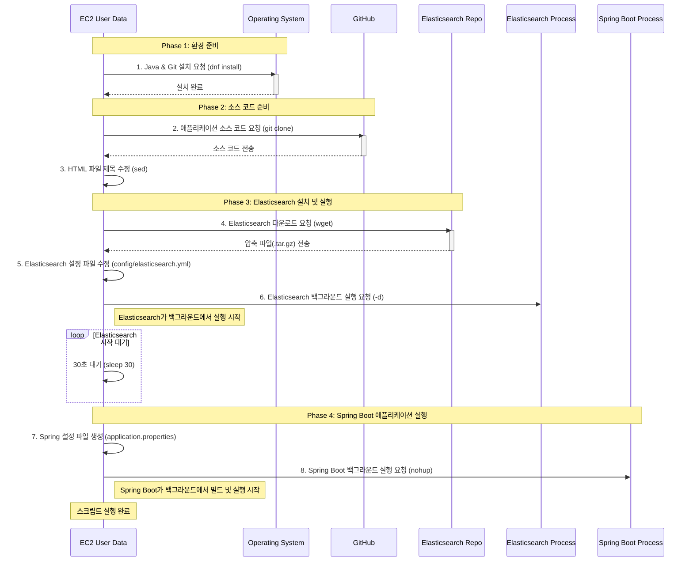

# 📗 08.22 ~ 08.26 AWS
## 📚 3 Tier Architecture Project Finshed
### 🖋️ 계획 수립

- 팀장 : 김도영
- 발표자 : 박세진, 홍승재
- 아키텍처 설계 : 구인정, 박세진
- AWS Cloud 구현 : 김도영, 홍승재, 이현정
- 모니터링, 로그 설정 : 구인정, 박세진
- SLA / SLO 정책 : 김도영
- 상품 조회 서비스라는 가정 하에 진행

---

## VPC

---


### AWS VPC 3-Tier 아키텍처 구성 (이중화)

- **가용영역(AZ) 이중화 :** 2개의 가용영역(AZ1, AZ2)으로 구성하여 장애 대응 및 가용성 확보
- **서브넷 구성** : 각 AZ마다 Public / Private / DB 서브넷으로 3-tier 아키텍처 구축 (추후, 서브넷 확장성 고려)
    - Public : 10.0.1.0/24, 10.0.2.0/24
    - Private : 10.0.21.0/24, 10.0.22.0/24
    - DB : 10.0.41.0/24, 10.0.42.0/24
- **퍼블릭 서브넷**
    - NAT Gateway 배치 → Private 서브넷 웹 서버가 인터넷 접근 가능 (예 : Git)
    - Bastion Host 배치 → 관리자가 Private 서버 접근 가능
    - 인터넷 게이트웨이 연결
- **프라이빗 서브넷**
    - Private 서브넷에 웹 서버 배치
    - 오토스케일링 그룹 적용으로 부하에 따라 인스턴스 자동 스케일링
    - 초기 인스턴스 2대는 Scale-in Protection 적용하여 유지
- **DB 서브넷**
    - RDS를 Master/Standby 구성(Multi-AZ)으로 배치하여 서비스 지속성 확보
- **로드밸런싱**
    - ELB 배치 → 클라이언트 요청 부하 분산
- **S3 버킷**
    - 정책 기반 로그 저장 및 관리 (자세한 내용 로그 관리 정책 참고)

# 📑 로그 관리 정책

---


## 1. 저장 정책

- **저장소 :** AWS S3 (프로젝트 전용 버킷 `team-s3-test/logs/`)
- **구조 :** 날짜 단위로 json으로 저장
    - `team-s3-test/logs/YYYYMMDD:HHMMSS`
- **권한 관리**
    - Write 권한 → 로그 생성 서비스 계정 (IAM Role)
    - Read 권한 → 관리자/분석 담당자만 허용 (IAM Policy 최소 권한 원칙 적용)

## 2. 수명 주기 관리 (Lifecycle Management)

- **보관 기간 구분**
    - **~ 1일**: Local
    - **1일 ~** : S3 Standard (빠른 접근)
    - **30일** ~: S3 Standard-IA (저비용, 비정기 접근용)
    - **180일 ~** : S3 Glacier Deep Archive (아카이브)
    - **noncurrent version** : 14일 이후 삭제

| 구분 | 저장/보관 기간 | 스토리지 타입 | 이유/산정 근거 |
| --- | --- | --- | --- |
| **Local** | ~1일 | 로컬 디스크 | 실시간 분석, 장애 시 빠른 복구 필요. 접근 속도 최우선. |
| **S3 Standard** | 1일~30일 | Standard | 일간/주간 분석, 빠른 접근 필요. 접근 빈도 높음. |
| **S3 Standard-IA** | 30일~180일 | Standard-IA | 과거 로그지만 분석 필요 가능성 존재. 비용 절감 우선. |
| **S3 Glacier Deep Archive** | 180일~ | Glacier Deep Archive | 장기 보관용 아카이브. 접근 거의 없음, 비용 최소화 목적. |
| **Noncurrent Version** | 14일 이후 삭제 | Standard/IA/Glacier | 버전 관리로 인한 불필요 중복 제거, 스토리지 효율화. |

## 3. 무결성 및 보안

- **S3 버전 관리(Versioning) :** ON (삭제/변조 발생 시 복구 가능)
- **S3 Object Lock :** Compliance 모드로 30일 적용 (삭제 불가 보장)
- **암호화:**
    - 서버 측 암호화 (SSE-S3 기본 적용)
    - 민감 데이터 포함 시 KMS 키 사용 (SSE-KMS)

| 구분 | 관리 항목 | 설정 | 근거/설명 |
| --- | --- | --- | --- |
| **무결성** | S3 Versioning | ON | 삭제·변조 발생 시 복구 가능. |
| **보안** | Object Lock | Compliance 30일 | 삭제 불가 보장으로 감사/규제 대응 가능. |
| **암호화** | SSE-S3, SSE-KMS | 기본/Sensitive 데이터 | 데이터 보호 및 규제 준수. |
| **접근 권한** | IAM Role/Policy | 최소 권한 | 원치 않는 접근 방지. |
| **모니터링** | CloudWatch + SNS | Put/Delete 감시 | 이상 징후 조기 알림.
 |

## 4. Slack 알림


- CloudWatch로 CPU 사용률 증가 시 Slack 알림과 엔드포인트를 이메일로 지정
- 알림과 함께 S3에 로그 저장
- CPU 사용량이 증가하면 Slack에 경고로 알림


- CPU 사용량이 줄어들면 Slack에 정상으로 알림


- Slack과 함께 경고 알림 이메일로 전송


- Slack과 함께 정상 알림 이메일로 전송


- CPU의 변동이 있을 때마다 S3에 로그 저장


- 전체 기간의 CPU 사용량 로그
    - CloudWatch에서 30일 동안 보관
    - 비용 문제, 30일 지난 애들은 S3 파일로 저장

## 5. 모니터링


- Grafana 사용을 위한 IAM 정책 설정


- 공식 Grafana 사이트에서 권고하는 정책 사항

[Amazon CloudWatch data source | Grafana documentation](https://grafana.com/docs/grafana/latest/datasources/aws-cloudwatch/)

- CloudWatch로 Grafana 연동
    - CPU View로 CPU 사용량 확인 가능
    - Memory View로 메모리 사용량 확인 가능
    - Network View로 NetworkIn, NetworkOut 확인 가능


# 📑 SLA / SLO

---

## 1. 서비스 가용성 (검색 API 99.8~99.9%)

- **가능한 작업**
    1. **AWS Managed Elasticsearch 사용 + Multi-AZ 배포**
        - 노드 일부 다운에도 검색 가능
    2. **CloudWatch 모니터링**
        - Cluster Health, 노드 상태, CPU/Memory/Network 지표
        - 임계치 초과 시 SNS 알림
    3. **EC2/Lambda 앞에 ELB 구성**
        - 트래픽 분산 및 단일 인스턴스 장애 시 자동 Failover
    4. **정기 점검**
        - 노드 상태 확인, ES 로그 점검

## 2. 검색 품질 (98.5~99%)

- **가능한 작업**
    1. **Replica 1 이상 설정 확인**
        - 노드 일부 장애에도 검색 성공률 유지
    2. **CloudWatch + SNS 모니터링 (Slack)**
        - 오류 검색 시 알람 전송

## 3. 장애 및 복구 (중대 3시간 / 일반 8시간)

- **가능한 작업**
    1. **Daily Snapshot 자동화**
        - ES → S3 저장
    2. **Cluster Health 모니터링**
        - Red 상태 알람 → 담당자 수동 조치

## 4. 백업 및 데이터 관리 (99%)

- **가능한 작업**
    1. **S3 버킷 생성**
        - EBS 스냅샷 저장
    2. **Lifecycle Rule 적용**
        - Glacier Deep Archive로 장기 보관
    3. **백업 성공 여부 모니터링**
        - CloudWatch Event → SNS 알림

## 5. 지원 요청 (95% 24h 1차 응답)

- **가능한 작업**
    1. **간단한 Slack 알림 연동**
        - CloudWatch 알람, 사용자 오류 수집
    2. **응답 매뉴얼 작성**
        - “오류 확인 → 로그 확인 → 1차 회신 → 필요시 Snapshot 복구” 단계 기록

| 항목 | 목표 | ES 특성 반영 이유 |
| --- | --- | --- |
| 가용성 | 99.8~99.9% | 분산 구조로 노드 일부 다운 허용, 색인 재배치 시간 포함 |
| 검색 성공률 | 98.5~99% | 색인 지연, 샤드 불균형 가능성 감안 |
| 중대 장애 복구 | 3시간 | 클러스터 자동 재배치 가능 |
| 일반 장애 복구 | 8시간 | 색인 재생성·샤드 재배치 시간 포함 |
| 백업 준수율 | 99% | 스냅샷 실패 가능성 감안 |
| 지원 요청 | 95% | 사용자 체감 + 엔지니어 대응 현실적 목표 |

# Elactic Search

---

### 상품 정보 조회 서비스에서 RDS 대신 Elasticsearch를 사용한 이유

1. **검색 성능 최적화**
    - 상품 조회 서비스에서는 사용자가 다양한 조건으로 검색하고, 텍스트 기반 필터와 정렬을 수행합니다.
    - RDS에서 `LIKE` 쿼리나 복잡한 조건 검색은 성능이 크게 저하될 수 있지만, Elasticsearch는 **Full-text 검색과 분석 기능**을 기본으로 제공하므로 빠른 검색이 가능합니다.
2. **스케일링 용이성**
    - 상품 데이터가 수백만 건 이상으로 증가할 경우, RDS는 읽기 성능 확장이 제한적입니다.
    - Elasticsearch는 **샤딩과 리플리카 구조**를 통해 읽기 위주의 서비스에서도 손쉽게 확장할 수 있습니다.
        - **샤딩(Sharding)**: 거대한 데이터(인덱스)를 '샤드'라는 여러 개의 작은 조각으로 나눕니다. 그리고 이 조각들을 여러 서버(노드)에 분산하여 저장합니다. 덕분에 하나의 거대한 데이터를 여러 서버가 동시에 처리할 수 있어 성능이 향상됩니다.
        - **리플리카(Replica)**: 각 샤드의 복제본을 만들어 다른 서버에 저장합니다. 이를 통해 하나의 서버에 문제가 생겨도 데이터 유실 없이 안정적으로 서비스를 운영할 수 있으며, 검색 요청을 여러 서버로 분산시켜 처리량을 높이는 효과도 있습니다.
3. **고급 검색 기능 제공**
    - 부분 일치, 오타 허용, 동의어 처리, 점수 기반 정렬 등 다양한 검색 기능을 기본으로 지원합니다.
    - RDS로 구현하려면 별도의 라이브러리와 쿼리 튜닝이 필요하지만, Elasticsearch는 이러한 기능이 내장되어 있어 개발 편의성이 높습니다.
4. **실시간 인덱싱 지원**
    - 상품이 자주 추가되거나 수정되는 경우에도 Elasticsearch는 **Near real-time 색인**을 지원합니다.
    - RDS는 단순 조회 구조이므로 실시간 검색 요구에는 한계가 있습니다.

**결론**

> 상품 정보 조회 서비스처럼 조회와 검색 성능이 핵심이고, 다양한 검색 조건과 정렬·추천 기능이 필요하며, 데이터 규모가 큰 경우에는 RDS보다 Elasticsearch가 더 적합합니다.
> 

### Auto Scaling시의 생성되는 인스턴스에 대한 자동 서버 실행 스크립트

- 자동화 스크립트
    
    ```bash
    #!/bin/bash
    # 에러 설정
    set -e
    
    # 실행 중 에코를 포함한 모든 로그를 백그라운드로 저장한다.
    # 출력은 tail -f /var/log/user-data.log 명령어로 터미널 창에서 진행상황 확인가능
    exec > >(tee /var/log/user-data.log|logger -t user-data -s 2>/dev/console) 2>&1
    
    # Move to the ec2-user's home directory
    cd /home/ec2-user
    
    # 1. 시스템 패키지 설치 (자바, Git)
    # 2. 애플리케이션 소스 코드 클론
    echo "Installing Java 17 and Git..."
    sudo dnf update -y
    sudo dnf install java-17-amazon-corretto-devel git -y
    echo "Cloning the Spring Boot application repository..."
    git clone https://github.com/dev-library/sd_day2_esbaseapp
    
    # 3. HTML 파일 내용 수정 (sed 명령어 사용)
    # 새로 생성되는 인스턴스상의 서버가 로드밸런서를 잘 통해서 실행되고 배분됨을 확인하기 위함
    echo "Modifying main.html title..."
    HTML_FILE="/home/ec2-user/sd_day2_esbaseapp/src/main/resources/templates/main.html"
    sed -i 's|<title>상품 검색</title>|<title>상품 검색3</title>|g' $HTML_FILE
    
    # 4. Elasticsearch 다운로드 및 압축 해제
    # 인터넷 상에서 elasticsearch의 특정 버젼을 압축상태로 다운받아 해제한다.
    echo "Downloading and extracting Elasticsearch..."
    wget https://artifacts.elastic.co/downloads/elasticsearch/elasticsearch-8.15.5-linux-x86_64.tar.gz
    tar -xzf elasticsearch-8.15.5-linux-x86_64.tar.gz
    
    # 5. Elasticsearch 설정 변경 (보안 기능 비활성화)
    # Elasticsearch가 HTTPS 모드로 실행 중인데, curl/앱에서 HTTP로 접속 시도시 거부한다고 출력
    # 보안(SSL/HTTPS) 관련 설정이 문제가 있어서 보안 기능을 비활성화
    echo "Disabling Elasticsearch security features..."
    ES_CONFIG_FILE="/home/ec2-user/elasticsearch-8.15.5/config/elasticsearch.yml"
    cat <<EOF >> $ES_CONFIG_FILE
    # 보안 기능 끄기
    xpack.security.enabled: false
    xpack.security.http.ssl.enabled: false
    # 단일 노드 클러스터로 실행하기 위한 설정
    discovery.type: single-node
    EOF
    # 파일 소유권을 ec2-user로 변경
    sudo chown -R ec2-user:ec2-user /home/ec2-user/elasticsearch-8.15.5
    
    # 6. Elasticsearch 백그라운드 실행
    echo "Starting Elasticsearch in the background..."
    sudo -u ec2-user /home/ec2-user/elasticsearch-8.15.5/bin/elasticsearch -d
    
    # Elasticsearch가 시작될 때까지 잠시 대기
    # Elasticsearch가 9200포트에서 우선 실행된 이후에 8080포트에서 실제 웹서버가 그걸 사용해 동작
    echo "Waiting for Elasticsearch to start..."
    sleep 30
    
    # 7. Spring Boot 애플리케이션 설정 파일(application.properties) 자동 생성
    # 원래 이 곳에 비밀번호와 유저네임도 들어가야 하지만 5번에서 보안기능을 off시켜놨기에 생략
    echo "Configuring Spring Boot application properties..."
    PROPERTIES_FILE="/home/ec2-user/sd_day2_esbaseapp/src/main/resources/application.properties"
    cat <<EOF > $PROPERTIES_FILE
    # Elasticsearch connection info (No username/password)
    spring.elasticsearch.uris=http://localhost:9200
    spring.elasticsearch.ssl.verification-mode=none
    EOF
    
    # 8. Spring Boot 애플리케이션 빌드 및 백그라운드 실행
    # gradlew에 권한을 부여하고 실행하는 부분.
    echo "Building and running the Spring Boot application..."
    cd /home/ec2-user/sd_day2_esbaseapp
    chmod +x gradlew
    # nohup을 사용하여 터미널 세션이 끊겨도 계속 실행되도록 하고, 로그는 app.log에 저장
    nohup ./gradlew bootRun > /home/ec2-user/app.log 2>&1 &
    
    echo "User data script finished successfully." 
    ```
    



## 기타

app.log는 웹서버의 실행시의 로그, user-data.log는 웹서버를 부팅하는 과정에서의 로그

echo로 출력하는 것도 모두 user-data.log에 저장.

ec2-user의 권한으로 모두 실행된다. 셸 스크립트를 sudo로 실시하는 것과 동일

EC2 탭에서 시작 탬플릿의 고급 세부정보 내부의 사용자 데이터에 스크립트를 넣는 것으로 매 탬플릿 시작 시마다 동작

시작 탬플릿 새 버전을 생성해서 기본 값으로 두면 된다.

## 현재 사용 용도

DB 없이 Elasticsearch를 메인 데이터 저장소 겸 검색 엔진으로 사용하는 중입니다.

Elasticsearch의 장점 중 검색에서의 장점만을 사용하여 검색기능을 구현하고 있습니다. 

## 예정 사항

현재 각 서버에 대해서 일레스틱 서치를 따로 동작하게 구성을 완료했습니다. 이후 **DummyDataLoader.java**에 샤드와 리플리카 yml에 클러스터, 노드명을 지정해서 여러 노드들간의 통신을 구현할 경우 일레스틱 서치에 대해 추가적으로 구축되는 것입니다.

## 수행 시 고려될 사항

이렇게 구축할 시 각 노드가 서로의 ip를 알게 해야하지만 오토 스케일링 시의 ip 부여에 대해서 어려움이 존재한다.